# Bank accounts management


## Objective
Your assignment is to build an internal API for a fake financial institution
### Brief
While modern banks have evolved to serve a plethora of functions, at their core, banks must provide certain basic features. Today, your task is to build the basic HTTP API for one of those banks! Imagine you are designing a backend API for bank employees. It could ultimately be consumed by multiple frontends (web, iOS, Android etc).
### Tasks
- Design DB.
- Implement class diagram.
- There should be API routes that allow them to:
    - Create a new bank account for a customer, with an initial deposit amount. A
      single customer may have multiple bank accounts.
    - Transfer amounts between any two accounts, including those owned by
      different customers.
    - Retrieve balances for a given account.
    - Retrieve transfer history for a given account.

---
### How to set up & run this project?
In this project, we will use docker for the development process. In particular, Laravel has a package that helps us to easily manage and set it up. And it's name is [Sail](https://laravel.com/docs/10.x/sail).
- Install docker
- Copy .env.example to .env and start filling in the values.
  ```shell
    cp .env.example .env
    ```
- Run below commands:
  ```shell
    docker-compose up -d
    docker-compose run laravel.test composer install
    ./vendor/bin/sail up --build
    ./vendor/bin/sail php artisan key:generate
    ./vendor/bin/sail php artisan migrate
    ./vendor/bin/sail php artisan db:seed
    ```


### DB Diagram


### Endpoints
```shell
  GET|HEAD   api/bank_accounts/{accountId}/balance .................................... BankAccountController@balances
  GET|HEAD   api/bank_accounts/{accountId}/transaction_history ......................... BankAccountController@history
  POST       api/banks/transfer .............................................................. BankController@transfer
  POST       api/customers/{customerId}/bank_accounts ................................... BankAccountController@create
```
### Class Diagram

```mermaid
classDiagram
  direction BT
	class BankAccountController {
	   __construct(bankAccountService) 
	    bankAccountService
	   balance(request, accountId) 
	   history(request, accountId) 
	   create(request, customerId) 
	}
	
	class BankController {
	   __construct(bankService) 
	    bankService
	   transfer(request) 
	}
	
	class Controller
	
	BankAccountController  -->  Controller 
	BankController  -->  Controller 
	
	  direction B	
	class BankAccountService {
	   __construct(bankAccountRepository, transactionRepository) 
	   getAllTransactionsByAccount(accountId) 
	   getBalance(accountId) 
	   createBankAccountForCustomer(customerId, body) 
	   getBankAccount(accountId) 
	}
	class BankAccountServiceInterface {
	   getAllTransactionsByAccount(accountId) 
	   createBankAccountForCustomer(customerId, body) 
	   getBalance(accountId) 
	   getBankAccount(accountId) 
	}
	
	BankAccountService  ..>  BankAccountServiceInterface 
	
	class BankService {
	   __construct(bankAccountRepository, transactionRepository) 
	   transfer(from, to, amount) 
	}
	class BankServiceInterface {
	   transfer(from, to, amount) 
	}
	
	BankService  ..>  BankServiceInterface 
	
	class BankAccountRepository {
	   __construct(model) 
	   getBankAccountsIn(accountNumberList) 
	   get(accountId) 
	   create(customerId, payload) 
	}
	class BankAccountRepositoryInterface {
	   getBankAccountsIn(accountNumberList) 
	   get(accountId) 
	   create(customerId, payload) 
	}
	
	BankAccountRepository  ..>  BankAccountRepositoryInterface 
	
class TransactionRepository {
   __construct(transactionModel, transactionDetailModel) 
   getAllTransactionDetailByAccount(accountNumber) 
   createTransaction(from, to, amount) 
}
class TransactionRepositoryInterface {
   getAllTransactionDetailByAccount(accountNumber) 
   createTransaction(from, to, amount) 
}

TransactionRepository  ..>  TransactionRepositoryInterface 
```



### Postman Collection
- [Collection](docs/bank_accounts_management.postman_collection.json)

### Reference sources
- **[Laravel 11.x](https://laravel.com/)**


### Contact
- Full Name: Dang Nghia
- Email: dangnghia25197@gmail.com
- LinkedIn: https://www.linkedin.com/in/dangnghia


