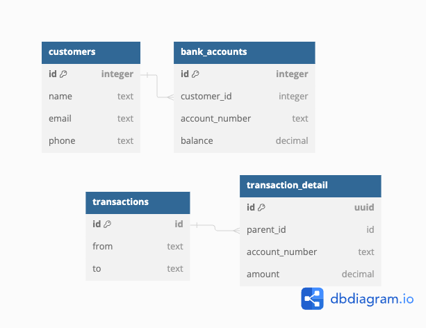

# Bank accounts management


## Objective
Your assignment is to build an internal API for a fake financial institution
### Brief
While modern banks have evolved to serve a plethora of functions, at their core, banks must provide certain basic features. Today, your task is to build the basic HTTP API for one of those banks! Imagine you are designing a backend API for bank employees. It could ultimately be consumed by multiple frontends (web, iOS, Android etc).
### Tasks
- Design DB.
- Implement class diagram.
- There should be API routes that allow them to:
    - Create a new bank account for a customer, with an initial deposit amount. A
      single customer may have multiple bank accounts.
    - Transfer amounts between any two accounts, including those owned by
      different customers.
    - Retrieve balances for a given account.
    - Retrieve transfer history for a given account.

---


### DB Diagram


### Endpoints
```shell
  GET|HEAD   api/bank_accounts/{accountId}/balance .................................... BankAccountController@balances
  GET|HEAD   api/bank_accounts/{accountId}/transaction_history ......................... BankAccountController@history
  POST       api/banks/transfer .............................................................. BankController@transfer
  POST       api/customers/{customerId}/bank_accounts ................................... BankAccountController@create
```
